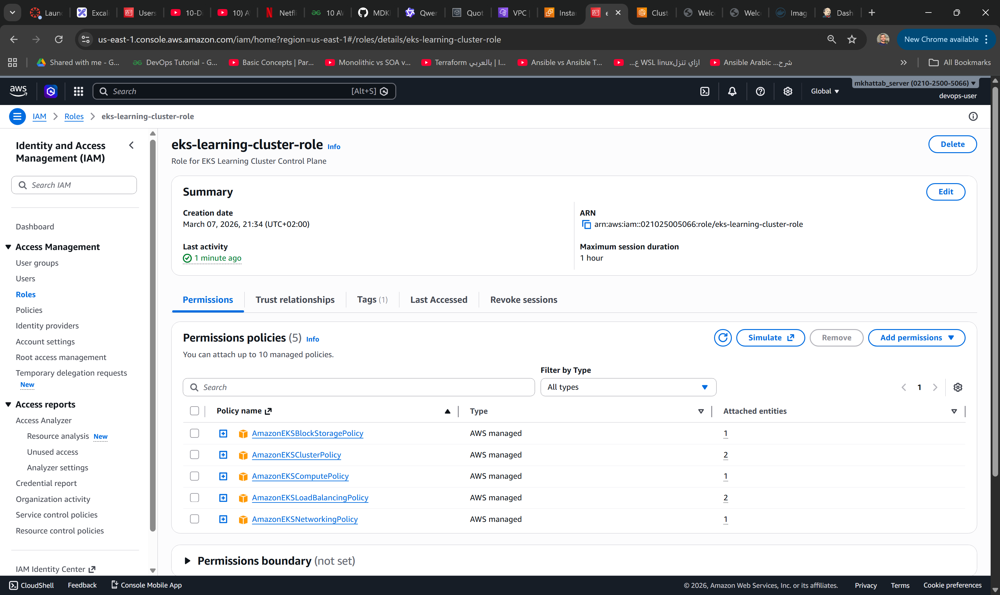
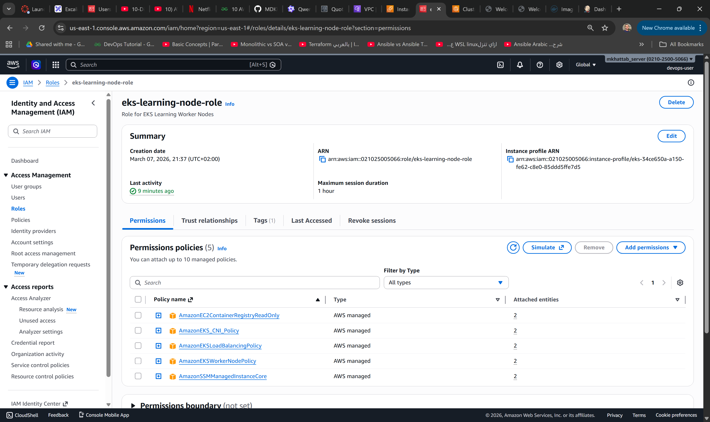
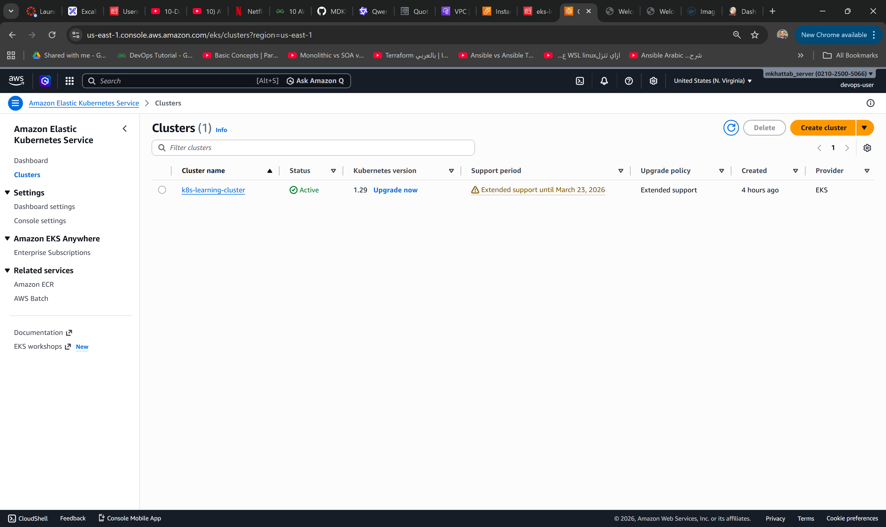
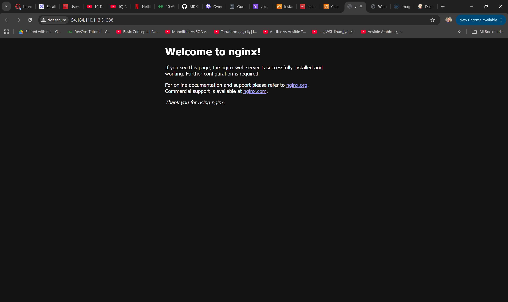
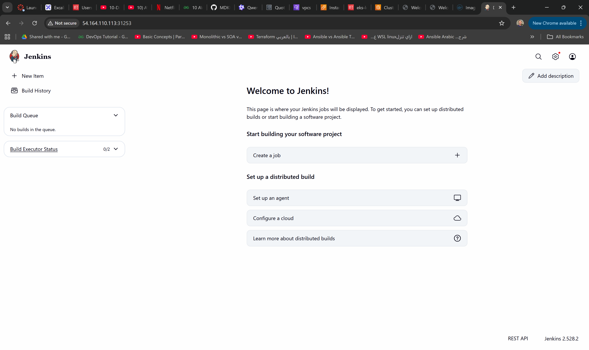

# 🚀 Kubernetes Cluster on AWS EKS with On-Demand Instances

A comprehensive guide to deploying a production-ready Kubernetes cluster on AWS using EKS (Elastic Kubernetes Service) with EC2 On-Demand Instances for reliable workloads.

---

## 📋 Table of Contents

- [Project Overview](#project-overview)
- [Architecture](#architecture)
- [Prerequisites](#prerequisites)
- [Phase 1: Local Preparation](#phase-1-local-preparation)
- [Phase 2: VPC & Networking](#phase-2-vpc--networking)
- [Phase 3: IAM Roles](#phase-3-iam-roles)
- [Phase 4: EKS Cluster Creation](#phase-4-eks-cluster-creation)
- [Phase 5: kubectl Configuration](#phase-5-kubectl-configuration)
- [Phase 6: Node Group Creation](#phase-6-node-group-creation)
- [Phase 7: Application Deployment](#phase-7-application-deployment)
- [Troubleshooting Guide](#troubleshooting-guide)
- [Cleanup](#cleanup)
- [Lessons Learned](#lessons-learned)

---

## 📖 Project Overview

### **Goal**
Deploy a Kubernetes cluster on AWS using EC2 On-Demand Instances to achieve **reliable, always-available** worker nodes for production workloads with full control over instance types and capacity.

### **Key Technologies**
| Technology | Purpose |
|------------|---------|
| **Amazon EKS** | Managed Kubernetes control plane |
| **EC2 On-Demand Instances** | Reliable worker nodes with guaranteed capacity |
| **VPC** | Isolated network environment |
| **IAM** | Security and access control |
| **kubectl** | Kubernetes command-line tool |
| **EKS Auto Mode** | Simplified cluster management |

### **Cost Estimate**
| Resource | Configuration | Monthly Cost |
|----------|---------------|--------------|
| 2x t3.medium (720 hrs/month) | On-Demand | ~$50/month |
| EKS Control Plane | Managed | ~$72/month |
| **Total** | **2 nodes + Control Plane** | **~$122/month** |

> 💡 **Note**: On-Demand instances provide guaranteed capacity and are ideal for production workloads. For cost optimization, consider Spot Instances for non-critical workloads.

---

## 🏗️ Architecture
┌─────────────────────────────────────────────────────────────────┐
│ AWS Region (us-east-1)                                          │
│                                                                 │
│ ┌─────────────────────────────────────────────────────────┐     │
│ │ VPC: 10.100.0.0/16                                      │     │
│ │ ┌─────────────────────────────────────────────────┐     │     │
│ │ │ Public Subnets                                  │     │     │
│ │ │ ┌──────────────┐ ┌──────────────┐               │     │     │
│ │ │ │ 10.100.1.0/24│ │ 10.100.2.0/24│               │     │     │
│ │ │ │ (AZ-1a)      │ │      (AZ-1b) │               │     │     │
│ │ │ └──────────────┘ └──────────────┘               │     │     │
│ │ └─────────────────────────────────────────────────┘     │     │
│ │                                                         │     │ 
│ │ ┌─────────────────────────────────────────────────┐     │     │
│ │ │ EKS Cluster                                     │     │     │
│ │ │ ┌─────────────┐                                 │     │     │
│ │ │ │Control Plane│ (Managed by AWS)                │     │     │
│ │ │ └─────────────┘                                 │     │     │
│ │ │                                                 │     │     │
│ │ │ ┌─────────────────────────────────────────┐     │     │     │
│ │ │ │ Worker Node Groups                      │     │     │     │
│ │ │ │ ┌─────────┐ ┌─────────┐ ┌─────────┐     │     │     │     │
│ │ │ │ │On-Demand│ │On-Demand│ │On-Demand│     │     │     │     │
│ │ │ │ │ Node    │ │ Node    │ │ Node    │     │     │     │     │
│ │ │ │ └─────────┘ └─────────┘ └─────────┘     │     │     │     │
│ │ │ └─────────────────────────────────────────┘     │     │     │
│ │ └─────────────────────────────────────────────────┘     │     │
│ └─────────────────────────────────────────────────────────┘     │
└─────────────────────────────────────────────────────────────────┘
▲
│ (kubectl access)
┌─────────────┐
│ Laptop      │
│ (AWS CLI)   │
└─────────────┘

---

## 📦 Prerequisites

### **Software Requirements**
| Tool | Version | Installation |
|------|---------|--------------|
| **kubectl** | v1.28+ | [Download](https://kubernetes.io/docs/tasks/tools/) |
| **AWS CLI v2** | 2.x+ | [Download](https://aws.amazon.com/cli/) |
| **AWS Account** | Active | [Sign Up](https://aws.amazon.com/) |

### **Installation Commands**

```bash
# Install kubectl (Linux)
curl -LO "https://dl.k8s.io/release/$(curl -L -s https://dl.k8s.io/release/stable.txt)/bin/linux/amd64/kubectl"
chmod +x kubectl
sudo mv kubectl /usr/local/bin/

# Install AWS CLI v2 (Linux)
curl "https://awscli.amazonaws.com/awscli-exe-linux-x86_64.zip" -o "awscliv2.zip"
unzip awscliv2.zip
sudo ./aws/install

# Verify installations
kubectl version --client
aws --version


AWS Configuration
# Configure AWS credentials
aws configure

# Verify configuration
aws sts get-caller-identity

🚀 Phase 1: Local Preparation
# Verify tools
kubectl version --client
aws --version
aws sts get-caller-identity

# Create project notes file
echo "=== Project: Kubernetes on AWS EKS ===" > k8s-project-notes.txt
echo "Region: us-east-1" >> k8s-project-notes.txt
echo "Date Started: $(date)" >> k8s-project-notes.txt


🌐 Phase 2: VPC & Networking
Console Steps:
AWS Console → VPC → Create VPC
Select "VPC and more"
Configure:
Name: k8s-learning-vpc-unique
IPv4 CIDR: 10.100.0.0/16 (UNIQUE to avoid conflicts)
Public Subnets: 2 subnets in different AZs
DNS: Enable DNS hostnames & resolution
Enable Auto-Assign Public IPv4:
VPC Console → Subnets → Select each public subnet
Actions → Edit subnet settings
✅ Check "Enable auto-assign public IPv4 address"
Save

Add Required Tags for Load Balancer:
Key: kubernetes.io/role/elb
Value: 1

Key: kubernetes.io/cluster/k8s-learning-cluster
Value: owned

### VPC


🔐 Phase 3: IAM Roles
Cluster Role (eks-learning-cluster-role):
IAM Console → Roles → Create role
Trusted entity: AWS service → EKS → EKS - Cluster
Attach policies:
1-AmazonEKSClusterPolicy
2-AmazonEKSBlockStoragePolicy
3-AmazonEKSComputePolicy
4-AmazonEKSLoadBalancingPolicy
5-AmazonEKSNetworkingPolicy
Update Trust Policy:
{
  "Version": "2012-10-17",
  "Statement": [
    {
      "Effect": "Allow",
      "Principal": { "Service": "eks.amazonaws.com" },
      "Action": ["sts:AssumeRole", "sts:TagSession"]
    }
  ]
}



Node Role (eks-learning-node-role):
IAM Console → Roles → Create role
Trusted entity: AWS service → EC2
Attach policies:
1-AmazonEKSWorkerNodePolicy
2-AmazonEKS_CNI_Policy
3-AmazonEC2ContainerRegistryReadOnly
4-AmazonSSMManagedInstanceCore
Verify Trust Policy:
{
  "Version": "2012-10-17",
  "Statement": [
    {
      "Effect": "Allow",
      "Principal": { "Service": "ec2.amazonaws.com" },
      "Action": "sts:AssumeRole"
    }
  ]
}



☸️ Phase 4: EKS Cluster Creation
Console Steps:
EKS Console → Add cluster → Create
Configure:
Name: k8s-learning-cluster
Kubernetes version: 1.28 or 1.29
Cluster service role: eks-learning-cluster-role
EKS Auto Mode: Enabled
Networking:
VPC: k8s-learning-vpc-unique
Subnets: 2 public subnets
Endpoint access: Public + Private enabled
⏳ Wait 10-15 minutes for status = Active



🔗 Phase 5: kubectl Configuration

# Update kubeconfig
aws eks update-kubeconfig --region us-east-1 --name k8s-learning-cluster

# Verify connection
kubectl config current-context
kubectl cluster-info
kubectl get nodes  # Will show "No resources found" - expected


👥 Phase 6: Node Group Creation
Create On-Demand Node Group:
EKS Console → Compute → Add node group
Configure:
Name: learning-nodes-ondemand
IAM Role: eks-learning-node-role
Capacity type: ✅ On-Demand
Instance types: t3.medium (or t2.micro for Free Tier)
Min/Max/Desired: 1 / 3 / 2
Subnets: Your public subnets
Create aws-auth ConfigMap (If Needed):
# Check if aws-auth exists
kubectl get configmap aws-auth -n kube-system

# If not found, create it:
kubectl apply -f - <<EOF
apiVersion: v1
kind: ConfigMap
metadata:
  name: aws-auth
  namespace: kube-system
data:
  mapRoles: |
    - rolearn: arn:aws:iam::021025005066:role/eks-learning-node-role
      username: system:node:{{EC2PrivateDNSName}}
      groups:
        - system:bootstrappers
        - system:nodes
EOF

kubectl get nodes
kubectl get pods -n kube-system

🚀 Phase 7: Application Deployment
Deploy Nginx:
kubectl create deployment nginx-app --image=nginx:latest
kubectl scale deployment nginx-app --replicas=3
kubectl get pods

kubectl expose deployment nginx-app --type=NodePort --port=80 --name=nginx-service
kubectl get service nginx-service

Access Application:
# Get node public IP
kubectl get nodes -o wide

# Get NodePort
kubectl get service nginx-service

# Access in browser: http://<EXTERNAL-IP>:<NODEPORT>




Deploy Jenkins:
kubectl create deployment jenkins --image=mokhattab/jenkins-with-docker:latest
kubectl scale deployment jenkins --replicas=1

kubectl expose deployment jenkins \
  --type=NodePort \
  --port=8080 \
  --target-port=8080 \
  --name=jenkins-service

# Get admin password
kubectl exec -it <jenkins-pod-name> -- cat /var/jenkins_home/secrets/initialAdminPassword



📚 Lessons Learned
✅ What Worked Well
EKS Auto Mode simplifies cluster management
On-Demand instances provide guaranteed capacity and reliability
Public subnets with auto-assign IPv4 simplifies networking for learning
NodePort services work well for testing and development
⚠️ Common Pitfalls
Node role must trust ec2.amazonaws.com (NOT eks.amazonaws.com)
EKS Auto Mode requires 4 additional managed policies + sts:TagSession
aws-auth ConfigMap needed for custom node groups with Auto Mode
Docker Hub uses / not - between username and repo (username/repo:tag)
Jenkins runs on port 8080, not 80 or 81
💡 Best Practices
Use unique VPC CIDR blocks to avoid conflicts (e.g., 10.100.0.0/16)
Tag all resources for cost tracking and identification
Set billing alarms to catch unexpected charges early
Clean up immediately after learning to avoid charges
Use NodePort for testing, LoadBalancer for production
Always verify IAM trust policies before creating node groups


🏆 Skills Demonstrated
✅ AWS Cloud Architecture (VPC, Subnets, Security Groups, IAM)
✅ Kubernetes Cluster Management (EKS, Node Groups, Deployments)
✅ IAM Configuration (Trust policies, Managed policies, Auto Mode permissions)
✅ Troubleshooting (IAM, networking, authentication, image pulls)
✅ DevOps Best Practices (cleanup, documentation, cost management)
✅ Security (IAM roles, security groups, least privilege)
✅ Application Deployment (Nginx, Jenkins, NodePort services)


👨‍💻 Author
DevOps Engineer - AWS Kubernetes Learning Project
